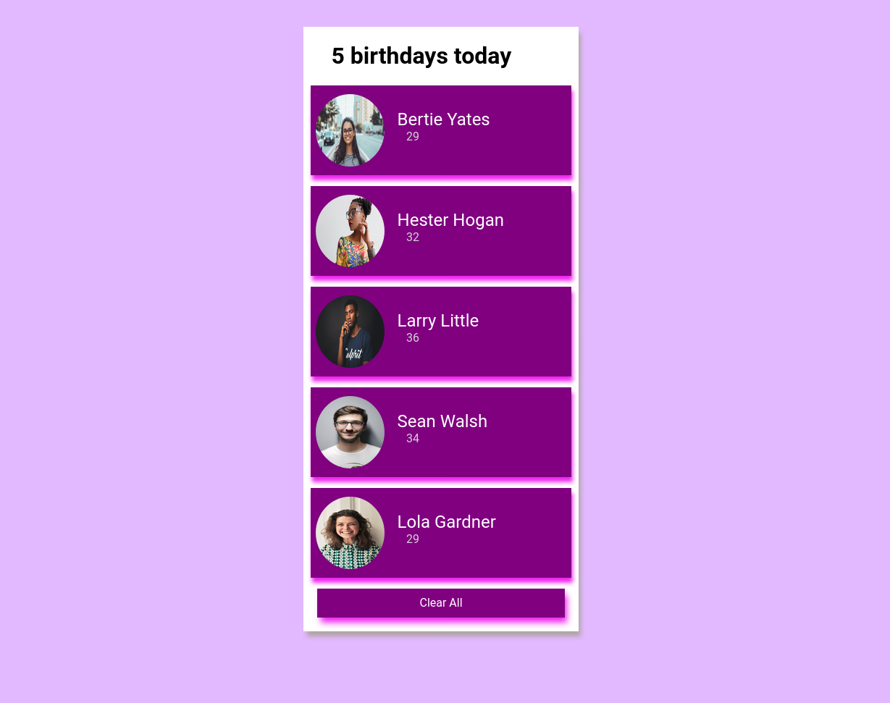

# Birthay Reminder
<br>

<br><br><br><br>

This project has been developed using React as an exercise for the ```useState``` hook.
It involves fetching data from server and storing it in a state.
Clicking on the **Clear All** button removes the data.

<br>

To run this project locally,

1. Clone the repository
2. Install packages using ```npm install ```
3. Start the development server using ```npm start```
